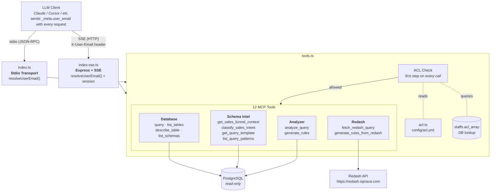
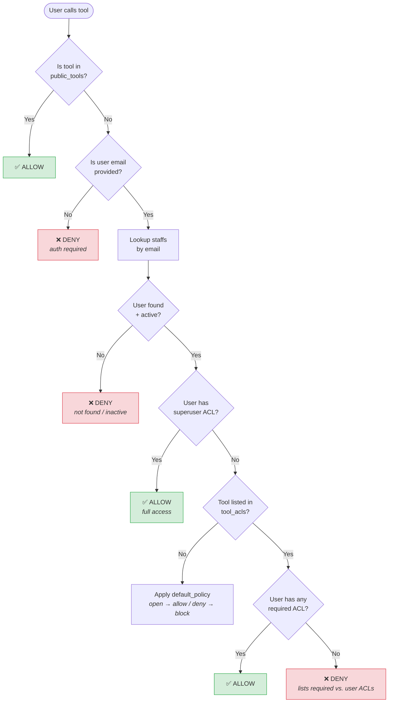

# Redash Query Integration, Rule Generator & ACL Enforcement

## Table of Contents

1. [Overview](#1-overview)
2. [Architecture](#2-architecture)
3. [Project Structure](#3-project-structure)
4. [Redash Integration](#4-redash-integration)
5. [SQL Query Analyzer](#5-sql-query-analyzer)
6. [Rule Generator](#6-rule-generator)
7. [CLI Tool](#7-cli-tool)
8. [ACL Enforcement](#8-acl-enforcement)
9. [MCP Tools Reference](#9-mcp-tools-reference)
10. [Configuration Reference](#10-configuration-reference)
11. [Environment Variables](#11-environment-variables)
12. [Usage Examples](#12-usage-examples)
13. [Developer Guide: Adding New ACLs or Tools](#13-developer-guide)
14. [Troubleshooting](#14-troubleshooting)

---

## 1. Overview

This document covers three interconnected systems added to the **lohono-db-context** MCP server:

1. **Redash Integration** — Fetch SQL queries directly from the Redash BI platform by query ID, enabling the LLM to pull and analyze production report queries on demand.
2. **SQL Query Analyzer & Rule Generator** — Analyze any SQL query to extract structural patterns (tables, joins, date filters, timezone conversions, etc.) and automatically generate YAML business rules, MCP tool definitions, and handler code.
3. **ACL Enforcement** — Per-tool access control that checks the user's email against `staffs.acl_array` in the database, ensuring only authorized users can invoke specific MCP tools.

These systems work together: a user can fetch a Redash query, analyze it, generate rules — and all of this is gated by their ACL permissions.

---

## 2. Architecture



---

## 3. Project Structure

```
lohono-db-context/
├── src/
│   ├── index.ts            # Stdio transport entry point (with ACL)
│   ├── index-sse.ts        # SSE/HTTP transport entry point (with ACL + session emails)
│   ├── tools.ts            # All 12 MCP tool definitions + handlers + ACL gate
│   ├── acl.ts              # ACL enforcement engine (config loader, DB resolver, cache)
│   ├── redash-client.ts    # Redash API client (fetch queries by ID)
│   ├── query-analyzer.ts   # SQL pattern extraction (regex-based analysis)
│   ├── rule-generator.ts   # Transforms analysis into YAML rules + tool code
│   ├── cli-generate.ts     # CLI for batch SQL analysis + Redash fetching
│   └── schema-rules.ts     # Sales funnel YAML loader + intent classifier
├── config/
│   ├── acl.yml             # Per-tool ACL configuration
│   └── sales_funnel_rules_v2.yml  # Sales funnel business rules
├── dist/                   # Compiled JavaScript
├── package.json
├── tsconfig.json
├── .env.example
├── DOCUMENTATION.md         # Original server documentation
└── REDASH_ACL_DOCS.md       # This file
```

---

## 4. Redash Integration

### 4.1 Overview

The Redash integration allows the MCP server to fetch SQL query definitions from a Redash instance by query ID. This enables workflows like:

- "Fetch Redash query #42 and analyze its structure"
- "Generate business rules from Redash queries 100, 105, 110"
- "What tables does Redash query #55 use?"

### 4.2 Redash Client (`src/redash-client.ts`)

The `RedashClient` class handles all communication with the Redash API.

**Configuration:**

- `REDASH_URL` — Base URL of the Redash instance (default: `https://redash.isprava.com`)
- `REDASH_API_KEY` — API key for authentication (required)

**API endpoint used:** `GET /api/queries/{id}` with `Authorization: Key <api_key>` header.

**Key exports:**

- `RedashClient` — Class with `fetchQuery(id)` and `fetchQueries(ids[])` methods
- `parseQueryIds(input)` — Parses a string of IDs (supports `"42"`, `"42,99,103"`, `"42 99 103"`)

**Response shape per query:**

```json
{
  "id": 42,
  "name": "Development Agents Phone/Email",
  "description": "...",
  "query": "SELECT ... FROM opportunities WHERE ...",
  "data_source_id": 1,
  "tags": ["sales", "agents"],
  "created_at": "2023-01-15T10:00:00Z",
  "updated_at": "2024-06-20T14:30:00Z",
  "user": { "id": 5, "name": "John", "email": "john@lohono.com" }
}
```

### 4.3 MCP Tools for Redash

#### `fetch_redash_query`

Fetch SQL and metadata from Redash. Does **not** analyze — just retrieves.

**Input:**

- `query_ids` (string, required) — Single ID or comma-separated: `"42"` or `"42,99,103"`

**Output:** Array of results with `id`, `name`, `description`, `sql`, `tags`, `user`, etc.

**Required ACL:** `DASHBOARD_TASK_REPORT_DOWNLOAD` or `STAFF_EDIT`

#### `generate_rules_from_redash`

All-in-one: fetch from Redash → analyze SQL → generate YAML rules + tool code.

**Input:**

- `query_ids` (string, required) — Single ID or comma-separated
- `category` (string, optional) — Category for generated rules (default: `"custom"`)
- `intent_keywords` (string[], optional) — Keywords for intent matching

**Output:** Per query: `yaml_rules`, `tool_definition`, `handler_code`, `summary`

**Required ACL:** `DASHBOARD_TASK_REPORT_DOWNLOAD` or `STAFF_EDIT`

---

## 5. SQL Query Analyzer

### 5.1 Overview (`src/query-analyzer.ts`)

The analyzer takes raw SQL and extracts structural patterns using regex-based detection. It produces a `QueryAnalysis` object with 14 extracted dimensions.

### 5.2 What It Extracts

| Dimension | Description |
|---|---|
| `tables` | All tables referenced (FROM + JOIN), with aliases and roles |
| `joins` | Join types, tables, aliases, ON conditions |
| `ctes` | Common Table Expressions (WITH clauses), their inner tables |
| `aggregations` | COUNT, SUM, AVG, etc. with DISTINCT detection |
| `date_filters` | Date range patterns (MTD, trailing months, fixed start, etc.) |
| `timezone_conversions` | IST conversions (`+ interval '330 minutes'` or `'5 hours 30 minutes'`) |
| `progressive_filters` | `date_part('day', ...) <= date_part('day', now())` patterns |
| `exclusions` | NOT IN, NOT EQUAL, NOT LIKE filters (slug exclusions, source exclusions) |
| `case_statements` | CASE/WHEN branches with aliases |
| `status_conditions` | WHERE clauses filtering on status/stage columns |
| `union_structure` | Whether the query uses UNION |
| `window_functions` | ROW_NUMBER, RANK, etc. with PARTITION BY/ORDER BY |
| `jsonb_operations` | JSONB operators (`->`, `->>`, `@>`, `#>`) |
| `distinct_counts` | COUNT(DISTINCT ...) expressions |
| `parameters` | Parameterized values (`$1`, `$2`, etc.) |
| `structure` | Overall shape: `single_table`, `multi_join`, `cte`, `union`, `cte_union` |

### 5.3 MCP Tool: `analyze_query`

**Input:** `sql` (string) — The raw SQL query to analyze

**Output:** Full `QueryAnalysis` JSON object

**Required ACL:** `DASHBOARD_TASK_REPORT_DOWNLOAD` or `STAFF_EDIT`

---

## 6. Rule Generator

### 6.1 Overview (`src/rule-generator.ts`)

Takes a `QueryAnalysis` plus metadata (name, description, category) and produces three artifacts:

1. **YAML Rules** — Ready to append to `config/sales_funnel_rules_v2.yml`
2. **MCP Tool Definition** — JSON Schema for a new tool based on the query
3. **Handler Code** — TypeScript snippet with Zod schema + handler block

### 6.2 Generated YAML Structure

```yaml
_generated:
  note: "Auto-generated by analyze_query + generate_rules. Review and customize before use."
  pattern_name: prospect_aging
  category: aging_reports

query_pattern:
  prospect_aging:
    category: aging_reports
    description: "Prospect aging report"
    user_intent_keywords: ["prospect aging", "stale prospects"]
    structure: multi_join
    applies_date_filter: mtd_current_progressive
    applies_timezone: true
    applies_progressive_filter: true
    applies_slug_exclusions: true
    applies_source_exclusion: false
    applies_distinct_counting: true

core_rules:
  timezone_conversion:
    description: "Convert timestamps to IST"
    format_used: "330 minutes"
    columns: [created_at, updated_at]
    mandatory: true
  slug_exclusions:
    description: "Exclude specific slugs"
    values: [test-slug, demo-slug]
    mandatory: true

validation_checks:
  - id: timezone_all_timestamps
    rule: "All timestamp columns have IST conversion"
  - id: slug_exclusions_applied
    rule: "Slug exclusions applied to correct tables"
```

### 6.3 MCP Tool: `generate_rules`

**Input:**

- `sql` (string, required) — The SQL query
- `pattern_name` (string, required) — Snake_case name, e.g. `"prospect_aging"`
- `description` (string, required) — Human-readable description
- `category` (string, required) — Category name
- `intent_keywords` (string[], optional) — Trigger keywords

**Output:** `yaml_rules`, `tool_definition`, `handler_code`, `summary`

**Required ACL:** `DASHBOARD_TASK_REPORT_DOWNLOAD` or `STAFF_EDIT`

---

## 7. CLI Tool

### 7.1 Overview (`src/cli-generate.ts`)

A command-line interface for batch SQL analysis and rule generation. Supports both local SQL files and Redash query IDs.

### 7.2 Usage

```bash
# From a local SQL file
npm run generate -- query.sql

# From a single Redash query ID
REDASH_API_KEY=<key> npm run generate -- --redash 42

# From multiple Redash query IDs
REDASH_API_KEY=<key> npm run generate -- --redash 42,99,103

# From a CSV file of Redash IDs
REDASH_API_KEY=<key> npm run generate -- --redash query_ids.csv

# Analysis only (no rule generation)
npm run generate -- --redash 42 --analyze-only

# With custom metadata
npm run generate -- --redash 42 --name my_report --category sales --keywords "monthly,funnel"

# Write output to files
npm run generate -- --redash 42 --out-yaml rules.yml --out-code handler.ts

# Batch output to a directory (one file set per query)
REDASH_API_KEY=<key> npm run generate -- --redash 42,99,103 --out-dir ./generated/
```

### 7.3 CLI Options

| Option | Description |
|---|---|
| `--redash` | Treat input as Redash query ID(s) or CSV file path |
| `--analyze-only` | Only run the analyzer, skip rule generation |
| `--name <name>` | Pattern name in snake_case (default: derived from file/query name) |
| `--description <text>` | Human-readable description |
| `--category <cat>` | Category (default: `"custom"`) |
| `--keywords <k1,k2>` | Comma-separated intent keywords |
| `--out-dir <dir>` | Write per-query `.yml`, `.handler.ts`, `.tool.json` files |
| `--out-yaml <path>` | Write YAML rules to file (single-query mode) |
| `--out-code <path>` | Write handler code to file (single-query mode) |

### 7.4 Batch Output

When `--out-dir` is used with multiple Redash queries, the CLI creates three files per query:

```
generated/
├── prospect_aging.yml           # YAML rules
├── prospect_aging.handler.ts    # Handler code snippet
├── prospect_aging.tool.json     # MCP tool definition
├── account_aging.yml
├── account_aging.handler.ts
└── account_aging.tool.json
```

### 7.5 CSV File Format

The CSV file for `--redash` can contain IDs in any format:

```
42
99
103
```

or comma-separated: `42,99,103`

or mixed: `42, 99, 103`

---

## 8. ACL Enforcement

### 8.1 Overview

Every MCP tool call is gated by an ACL check before execution. The system:

1. Identifies the user by their email address
2. Looks up their `acl_array` from the `staffs` table
3. Checks if any of the user's ACLs match the tool's required ACLs
4. Allows or denies access with a descriptive reason

### 8.2 User Email Resolution

The user's email is resolved in priority order:

| Priority | Source | Transport | How to Set |
|---|---|---|---|
| 1 | `_meta.user_email` | Both | LLM client sends in tool call params |
| 2 | `X-User-Email` header | SSE only | HTTP header on SSE connection |
| 3 | `MCP_USER_EMAIL` env var | Both | Environment variable (fallback) |

**Example — MCP tool call with `_meta`:**

```json
{
  "method": "tools/call",
  "params": {
    "name": "query",
    "arguments": { "sql": "SELECT 1" },
    "_meta": { "user_email": "john@lohono.com" }
  }
}
```

**Example — SSE connection with header:**

```bash
curl -H "X-User-Email: john@lohono.com" http://localhost:3000/sse
```

**Example — Stdio fallback:**

```bash
MCP_USER_EMAIL=john@lohono.com npm run dev
```

### 8.3 ACL Check Flow



### 8.4 ACL Configuration (`config/acl.yml`)

```yaml
# Policy for tools NOT listed in tool_acls:
#   "open"  → allow any authenticated + active user
#   "deny"  → block unless explicitly listed
default_policy: "deny"

# ACL values that grant access to ALL tools
superuser_acls:
  - STAFF_EDIT

# Tools that bypass authentication entirely
public_tools: []

# Per-tool ACL mappings (OR logic — user needs ANY one)
tool_acls:
  query:
    - DASHBOARD_TASK_VIEW
    - DASHBOARD_TASK_REPORT_DOWNLOAD
    - DASHBOARD_ENQUIRIES_VIEW
  # ... more tools ...
```

### 8.5 Current Tool → ACL Mapping

#### Database Tools (restricted — direct DB access)

| Tool | Required ACLs (any one) |
|---|---|
| `query` | `DASHBOARD_TASK_VIEW`, `DASHBOARD_TASK_REPORT_DOWNLOAD`, `DASHBOARD_ENQUIRIES_VIEW` |
| `list_tables` | `DASHBOARD_TASK_VIEW`, `DASHBOARD_TASK_REPORT_DOWNLOAD` |
| `describe_table` | `DASHBOARD_TASK_VIEW`, `DASHBOARD_TASK_REPORT_DOWNLOAD` |
| `list_schemas` | `DASHBOARD_TASK_VIEW`, `DASHBOARD_TASK_REPORT_DOWNLOAD` |

#### Sales Funnel Intelligence (broader access — read-only context)

| Tool | Required ACLs (any one) |
|---|---|
| `get_sales_funnel_context` | `DEVELOPMENT_OPP_LIST_VIEW`, `DEVELOPMENT_OPP_VIEW`, `DASHBOARD_ENQUIRIES_VIEW`, `DASHBOARD_TASK_VIEW` |
| `classify_sales_intent` | `DEVELOPMENT_OPP_LIST_VIEW`, `DEVELOPMENT_OPP_VIEW`, `DASHBOARD_ENQUIRIES_VIEW`, `ENQUIRY_LIST_VIEW` |
| `get_query_template` | `DEVELOPMENT_OPP_LIST_VIEW`, `DASHBOARD_ENQUIRIES_VIEW`, `DASHBOARD_TASK_VIEW` |
| `list_query_patterns` | `DEVELOPMENT_OPP_LIST_VIEW`, `DASHBOARD_ENQUIRIES_VIEW`, `DASHBOARD_TASK_VIEW` |

#### Query Analysis & Rule Generation (admin/engineering)

| Tool | Required ACLs (any one) |
|---|---|
| `analyze_query` | `DASHBOARD_TASK_REPORT_DOWNLOAD`, `STAFF_EDIT` |
| `generate_rules` | `DASHBOARD_TASK_REPORT_DOWNLOAD`, `STAFF_EDIT` |

#### Redash Integration (report-level access)

| Tool | Required ACLs (any one) |
|---|---|
| `fetch_redash_query` | `DASHBOARD_TASK_REPORT_DOWNLOAD`, `STAFF_EDIT` |
| `generate_rules_from_redash` | `DASHBOARD_TASK_REPORT_DOWNLOAD`, `STAFF_EDIT` |

### 8.6 The `staffs` Table

ACLs are stored in the `staffs.acl_array` column (PostgreSQL `character varying[]`).

```sql
SELECT email, acl_array, active
FROM public.staffs
WHERE LOWER(email) = 'john@lohono.com';

-- Example result:
-- email              | acl_array                                          | active
-- john@lohono.com    | {DASHBOARD_TASK_VIEW,DEVELOPMENT_OPP_LIST_VIEW}   | true
```

The system queries: `SELECT acl_array, active FROM public.staffs WHERE LOWER(email) = $1 LIMIT 1`

**Important checks:**
- User must exist in `staffs`
- `active` must be `true`
- `acl_array` must contain at least one ACL that matches the tool's requirements

### 8.7 Caching

User ACL lookups are cached in memory for **5 minutes** to avoid hitting the database on every tool call. The cache is keyed by normalized (lowercased) email.

Cache can be cleared programmatically via `clearAclCache()` from `src/acl.ts`.

### 8.8 Tool Listing Filtering

When the LLM calls `tools/list`, the response is filtered to **only include tools the user has access to**. This means the LLM won't attempt to call tools the user can't use.

- If no email is provided → only `public_tools` are listed
- If user has `STAFF_EDIT` (superuser) → all tools are listed
- Otherwise → only tools matching the user's ACLs are listed

### 8.9 Denial Response

When access is denied, the tool call returns an MCP error response:

```json
{
  "content": [
    {
      "type": "text",
      "text": "Access denied: tool \"query\" requires one of [DASHBOARD_TASK_VIEW, DASHBOARD_TASK_REPORT_DOWNLOAD, DASHBOARD_ENQUIRIES_VIEW]. User has: [ENQUIRY_LIST_VIEW, CUSTOMER_LIST_VIEW]"
    }
  ],
  "isError": true
}
```

---

## 9. MCP Tools Reference

### All 12 Tools

| # | Tool | Category | Input | ACL Tier |
|---|---|---|---|---|
| 1 | `query` | Database | `sql`, `params?` | Dashboard |
| 2 | `list_tables` | Database | `schema?` | Dashboard |
| 3 | `describe_table` | Database | `table_name`, `schema?` | Dashboard |
| 4 | `list_schemas` | Database | *(none)* | Dashboard |
| 5 | `get_sales_funnel_context` | Schema Intel | *(none)* | Sales View |
| 6 | `classify_sales_intent` | Schema Intel | `question` | Sales View |
| 7 | `get_query_template` | Schema Intel | `pattern_name` | Sales View |
| 8 | `list_query_patterns` | Schema Intel | *(none)* | Sales View |
| 9 | `analyze_query` | Analyzer | `sql` | Admin |
| 10 | `generate_rules` | Analyzer | `sql`, `pattern_name`, `description`, `category`, `intent_keywords?` | Admin |
| 11 | `fetch_redash_query` | Redash | `query_ids` | Admin |
| 12 | `generate_rules_from_redash` | Redash | `query_ids`, `category?`, `intent_keywords?` | Admin |

---

## 10. Configuration Reference

### `config/acl.yml`

| Field | Type | Default | Description |
|---|---|---|---|
| `default_policy` | `"open"` or `"deny"` | `"deny"` | What happens when a tool is not listed in `tool_acls` |
| `superuser_acls` | `string[]` | `["STAFF_EDIT"]` | ACLs that grant access to everything |
| `public_tools` | `string[]` | `[]` | Tools that require no authentication |
| `tool_acls` | `Record<string, string[]>` | *(see acl.yml)* | Per-tool ACL requirements |

### Available ACLs (from the application)

The system uses 150 ACL strings from the application's ACL table. Key ACLs relevant to MCP tools:

| ACL | Typical Use |
|---|---|
| `STAFF_EDIT` | Superuser — full access to all tools |
| `DASHBOARD_TASK_VIEW` | Dashboard users — DB read + schema intel |
| `DASHBOARD_TASK_REPORT_DOWNLOAD` | Report users — DB read + analysis + Redash |
| `DASHBOARD_ENQUIRIES_VIEW` | Enquiry dashboard — DB read + sales context |
| `DEVELOPMENT_OPP_LIST_VIEW` | Dev opportunity list — sales funnel context |
| `DEVELOPMENT_OPP_VIEW` | Dev opportunity detail — sales funnel context |
| `ENQUIRY_LIST_VIEW` | Enquiry list — sales intent classification |

---

## 11. Environment Variables

| Variable | Default | Description |
|---|---|---|
| `DB_HOST` | `localhost` | PostgreSQL host |
| `DB_PORT` | `5433` | PostgreSQL port |
| `DB_USER` | `lohono_api` | PostgreSQL user |
| `DB_NAME` | `lohono_api_production` | Database name |
| `DB_PASSWORD` | `""` | PostgreSQL password |
| `REDASH_URL` | `https://redash.isprava.com` | Redash instance base URL |
| `REDASH_API_KEY` | *(required for Redash tools)* | Redash API authentication key |
| `ACL_CONFIG_PATH` | `./config/acl.yml` | Path to ACL config YAML |
| `MCP_USER_EMAIL` | *(none)* | Fallback user email for stdio mode |
| `PORT` | `3000` | SSE server listen port |

---

## 12. Usage Examples

### 12.1 Fetch and Analyze a Redash Query (MCP)

```
User: "Fetch Redash query 42 and analyze its structure"

LLM calls: fetch_redash_query({ query_ids: "42" })
  → Gets SQL + metadata

LLM calls: analyze_query({ sql: "<the SQL from Redash>" })
  → Gets structural breakdown
```

### 12.2 Generate Rules from Redash (MCP — one step)

```
User: "Generate business rules from Redash queries 100, 105, and 110"

LLM calls: generate_rules_from_redash({
  query_ids: "100,105,110",
  category: "sales_reports"
})
  → Gets YAML rules + tool definitions + handler code for all 3
```

### 12.3 CLI — Batch Process Redash Queries

```bash
# Set the API key
export REDASH_API_KEY=7tgLNA1LIE2yc2annojiZPz07JR6wpJR5qRSrXzY

# Generate rules for 3 Redash queries into a directory
npm run generate -- --redash 42,99,103 --category sales_reports --out-dir ./generated/

# Analyze only (no code generation)
npm run generate -- --redash 42 --analyze-only

# Process from a CSV file
npm run generate -- --redash query_ids.csv --out-dir ./generated/
```

### 12.4 Testing ACL with Different Users

```bash
# User with DASHBOARD_TASK_VIEW — can use DB tools + sales context
MCP_USER_EMAIL=dashboard-user@lohono.com npm run dev

# User with STAFF_EDIT — superuser, can use everything
MCP_USER_EMAIL=admin@lohono.com npm run dev

# No email — all non-public tools are denied
npm run dev
```

### 12.5 SSE Mode with User Header

```bash
# Start SSE server
npm run dev:sse

# Connect with user identity
curl -H "X-User-Email: john@lohono.com" http://localhost:3000/sse
```

---

## 13. Developer Guide

### 13.1 Adding a New ACL to a Tool

Edit `config/acl.yml`:

```yaml
tool_acls:
  my_new_tool:
    - EXISTING_ACL_NAME
    - ANOTHER_ACL_NAME
```

No code changes needed — the ACL module reads the YAML at startup.

### 13.2 Adding a New Tool with ACL

1. Add the tool definition and handler in `src/tools.ts` (same as before)
2. Add its ACL mapping to `config/acl.yml`:

```yaml
tool_acls:
  my_new_tool:
    - DASHBOARD_TASK_VIEW
    - STAFF_EDIT
```

The ACL check in `handleToolCall()` automatically applies to all tools.

### 13.3 Making a Tool Public (No Auth)

```yaml
public_tools:
  - my_public_tool
```

### 13.4 Adding a New Superuser ACL

```yaml
superuser_acls:
  - STAFF_EDIT
  - MY_CUSTOM_ADMIN_ACL
```

### 13.5 Changing the Default Policy

```yaml
# "open" → unlisted tools are accessible to any active staff member
# "deny" → unlisted tools are blocked (safest)
default_policy: "open"
```

### 13.6 Hot-Reloading ACL Config

Currently, ACL config is loaded once at startup and cached. To reload without restarting:

```typescript
import { reloadAclConfig, clearAclCache } from "./acl.js";

reloadAclConfig();  // re-reads config/acl.yml
clearAclCache();    // clears user ACL cache
```

---

## 14. Troubleshooting

### "Authentication required" error

The user's email is not reaching the server. Check:
- Is `_meta.user_email` set in tool call params?
- Is `X-User-Email` header set on SSE connection?
- Is `MCP_USER_EMAIL` env var set (stdio mode)?

### "User not found" error

The email doesn't match any row in `staffs` table. Check:
- Is the email correct? (case-insensitive matching is used)
- Does the user exist in the `staffs` table?

### "User account is deactivated"

The user exists but `staffs.active = false`. An admin needs to reactivate the account.

### "Access denied: tool requires one of [...]"

The user exists and is active, but doesn't have the required ACL. Either:
- Add the required ACL to the user's `acl_array` in the `staffs` table
- Or add one of the user's existing ACLs to the tool's entry in `config/acl.yml`

### Redash "API key required" error

Set `REDASH_API_KEY` environment variable before starting the server or CLI.

### Stale ACL data

User ACLs are cached for 5 minutes. If you just changed a user's ACLs in the database, wait 5 minutes or restart the server.
